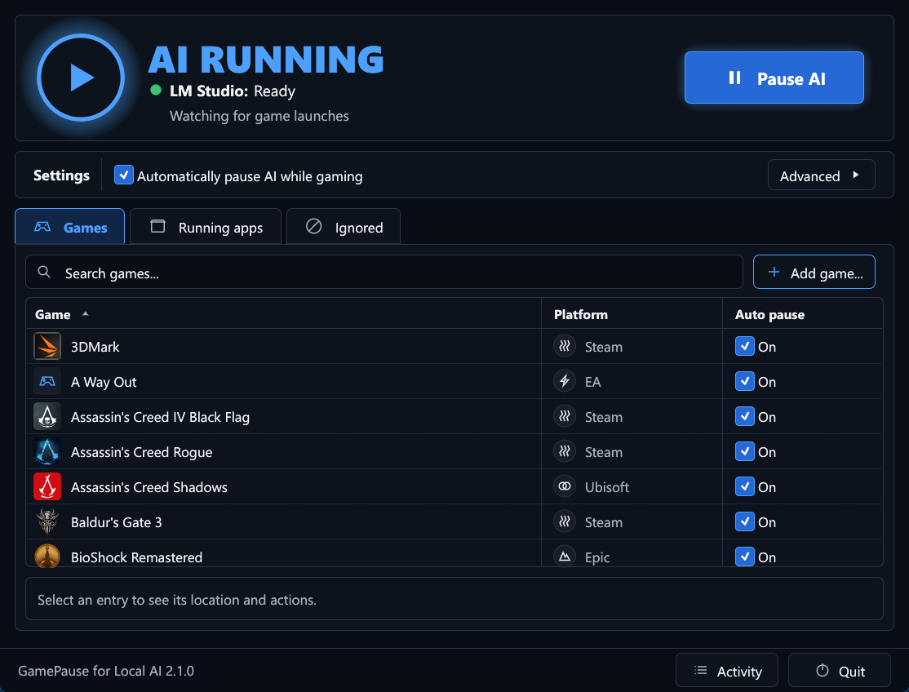
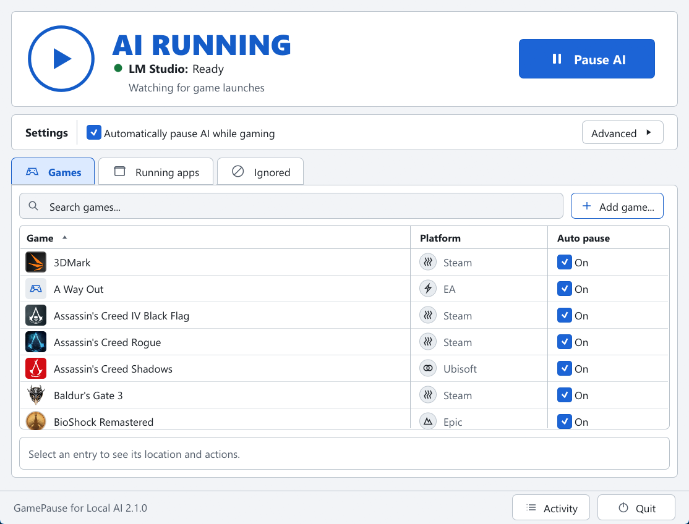
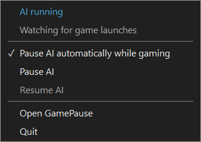

# GamePause for Local AI

[](https://github.com/Vkuparin/gamepause-for-local-ai/actions/workflows/ci.yml)
[](LICENSE)
[](docs/INSTALLATION.md)

**Give your games the VRAM. Get your local AI back afterward.**

GamePause is a small native Windows tray app. When a game starts, it saves what LM Studio and Ollama have loaded, unloads it, and puts everything back after you stop playing. There is no model list to maintain and nothing to configure first.



**[Download the latest release](https://github.com/Vkuparin/gamepause-for-local-ai/releases/latest)** (installer or portable ZIP) · [Changelog](CHANGELOG.md) · [Installation guide](docs/INSTALLATION.md)

## What it does

- **Pauses AI when a game starts.** Games from Steam, Epic, Xbox, EA, Ubisoft Connect and Battle.net are found automatically. Add anything else from **Running apps** or with **Add game...**.
- **Restores it when you are done.** 30 seconds after the last game exits, your models come back. Starting another game cancels the countdown; alt-tabbing does not end the pause.
- **LM Studio, restored exactly.** Every loaded LLM and embedding model returns with the same identifier, variant, TTL and load configuration, and the result is verified. The local server is stopped while you play, so clients cannot load models back in, and returned to its original state afterward.
- **Ollama, when it is running.** Local models are unloaded. GGUF completion models are reloaded with their context and the keep-alive time they had left. If Ollama is not running, nothing happens and nothing is reported as an error.
- **Other AI servers.** Pick a program file, such as `llama-server.exe` or `koboldcpp.exe`, and GamePause stops it for gaming and starts it again with the same command line. Not yet tested with those tools themselves.
- **A rule per game.** **On** pauses automatically, **Off** ignores the game, **Ask** leaves AI running and offers a one-click pause.
- **Manual control.** **Pause AI** and **Resume AI** in the dashboard and tray, plus an optional system-wide shortcut that works inside games.
- **Recovery that survives crashes.** What was unloaded is written to disk before anything changes. If GamePause or the PC goes down mid-pause, start GamePause again and it finishes the job.

It is local only: no telemetry, no downloads, no administrator service, and model control stays on localhost.

## One window, four states

The status card always shows one of four color-coded states: **AI running** (blue), **AI paused** (orange), **Loading** (yellow) and **AI needs attention** (red). Below it are one line for each AI app you have installed or running, the game that triggered the pause, and roughly how much memory was freed.



Light, dark and Windows high-contrast themes are supported, and the dashboard follows your Windows setting by default. **Advanced** holds the connection settings, detection options, the shortcut, read-only diagnostics and a round-trip test that pauses and restores your live models on request.

## Quick controls in the tray

Closing the window leaves GamePause watching from the tray. Left-click the icon to open the dashboard, or right-click for the current state and the quick controls.



## Get started

1. Download **Setup.exe** from [Releases](https://github.com/Vkuparin/gamepause-for-local-ai/releases) and install it. GamePause starts in the tray and, by default, at Windows sign-in.
2. Use LM Studio or Ollama as usual. For LM Studio, its `lms` command-line tool must be installed; GamePause finds it on its own.
3. Play. Automatic pausing is on from the first launch.

If a game is not recognized, open **Running apps** while it runs and choose **Add as game**. GamePause also points out fullscreen programs that look like games it does not know.

The installer and executables are unsigned, so Windows may show a publisher warning. Download from this repository and compare the SHA-256 checksums published with each release.

## Good to know

- **Busy models wait.** If a model is generating when a game starts, unloading waits until it finishes. Stop long-running agents before playing if you need the memory right away.
- **Ollama restores a subset.** Embedding models and models with unknown format are unloaded but not reloaded; load options, parallelism and conversations are not preserved. [Details](docs/USAGE.md#background-ai-applications).
- **LM Studio updates can need a GamePause update.** Full settings restoration uses LM Studio's internal protocol. After upgrading LM Studio, check **Advanced > Diagnostics**. If a complete snapshot cannot be captured, GamePause refuses to unload.
- **Quitting keeps a pending restore.** Models paused when you quit come back the next time GamePause runs. Restore before uninstalling.
- **Detection is best effort.** Protected processes and unusual installations may need to be added by hand.

## Tested with

| AI app | Version | Notes |
|---|---|---|
| LM Studio | 0.4.25 | Full restore uses LM Studio's internal protocol, so a newer version can need a GamePause update. |
| Ollama | 0.35.1 | One local GGUF model. Embedding, vision and multi-model sessions have automated coverage only. |
| llama.cpp, KoboldCpp | none yet | Stop and restart was tested with stand-in programs. |

Using another version? **Advanced > Diagnostics** shows what GamePause can see, and a [report](https://github.com/Vkuparin/gamepause-for-local-ai/issues) with that output helps extend this table.

## Documentation

| Guide | Covers |
|---|---|
| [Installation](docs/INSTALLATION.md) | Installer, portable use, prerequisites, startup, upgrades, uninstall |
| [Usage and recovery](docs/USAGE.md) | Session behavior, manual controls, crash recovery, CLI |
| [Configuration](docs/CONFIGURATION.md) | Every setting, custom games, exclusions |
| [Troubleshooting](docs/TROUBLESHOOTING.md) | Diagnostics and common failures |
| [Validation](docs/VALIDATION.md) | What was tested live, measured overhead, coverage limits |
| [Development](docs/DEVELOPMENT.md) | Build, architecture, safety rules, packaging |

## Build and contribute

Windows x64, the pinned Rust toolchain and Visual Studio C++ Build Tools are required:

```powershell
cargo test --locked
cargo fmt --check
cargo clippy --locked --all-targets -- -D warnings
cargo build --locked --release
```

See [Contributing](CONTRIBUTING.md), [Security](SECURITY.md) and the [roadmap](docs/ROADMAP.md). Free under the [MIT license](LICENSE); binary distributions include dependency licenses. GamePause is an independent community project, not affiliated with LM Studio, Ollama or any launcher vendor.
